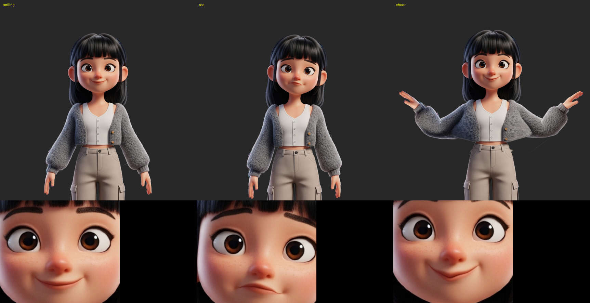

# rive-editor

Generate an animated Rive file from one static character PNG, with Claude Code and the Rive CLI.



[Watch live animation](https://www.rive.best/?share=80rmukr9vl)

## Setup

```bash
git clone https://github.com/tuanatelsa/rive-editor.git
cd rive-editor
brew install --cask rive-app/tap/rive-cli
uv sync
rive doctor
```

## Use it with Claude Code

1. Put your PNG in the repository or note its path. The PNG needs a transparent background.
2. Start Claude Code in the repository root: `claude`.
3. Describe the result. Examples:
   - `Make a Rive character from ~/Downloads/kai.png with moods happy, angry, wave.`
   - `For meiling, add a "thinking" mood: head tilt left, one brow up, small mouth.`
   - `Make the meiling sad mood stronger and slower.`

Claude follows the `rive-character` skill. It measures landmarks, writes `characters/<slug>/character.toml`, builds, renders a preview and gives you `characters/<slug>/build/<slug>.riv`.

## Use it by hand

```bash
uv run python tools/generate.py characters/meiling
rive characters/meiling --verify
rive characters/meiling --once
uv run python tools/preview.py characters/meiling --out .scratch/meiling.png
rive characters/meiling --data=mood=sad
```

The last command opens a live preview window.

## Runtime

Each `.riv` exposes the view model `Character` with the enum property `mood`. Set `mood` to a mood name to switch the animation.

## Constraints

- The PNG must be one character, front view, with a transparent background.
- The rig has six bones: root, head, and upper arm and forearm on each side. Legs do not move.
- Expressions only bend the existing pixels. The tool cannot open a closed mouth or add teeth or tears.
- Large arm rotations stretch the clothes between the arm and the torso.
- The local build has no signature. The scene has no scripts, so web runtimes load it.
